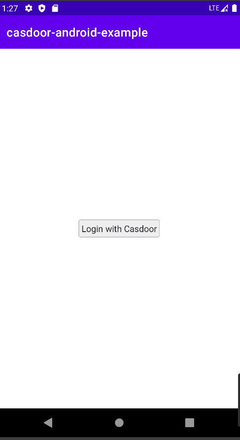

<h1 align="center" style="border-bottom: none;">📦⚡️Casdoor android example</h1>
<h3 align="center">An example of casdoor-android-sdk</h3>

## 	The example uses the following casdoor server:
The server: https://door.casdoor.com/

## Quick Start
- download the code
```bash
 git clone git@github.com:casdoor/casdoor-android-example.git
```

## Configure
Initialization requires 6 parameters, which are all str type:
|  Name (in order)   | Must  | Description |
|  ----  | ----  |----  |
| clientId  | Yes | Application.client_id |
| endpoint  | Yes | Casdoor Server Url, such as `door.casdoor.com` |
| organizationName  | Yes | Organization name |
| appName  | Yes | Application name |
| redirectUri  | Yes | URI of Web redirection |

```
 val casdoorConfig = CasdoorConfig(
            endpoint = "https://door.casdoor.com",
            clientID = "014ae4bd048734ca2dea",
            organizationName = "casbin",
            redirectUri = "casdoor://callback",
            appName = "app-casnode"
        )
```
## After running, you will see the following  interfaces:
 