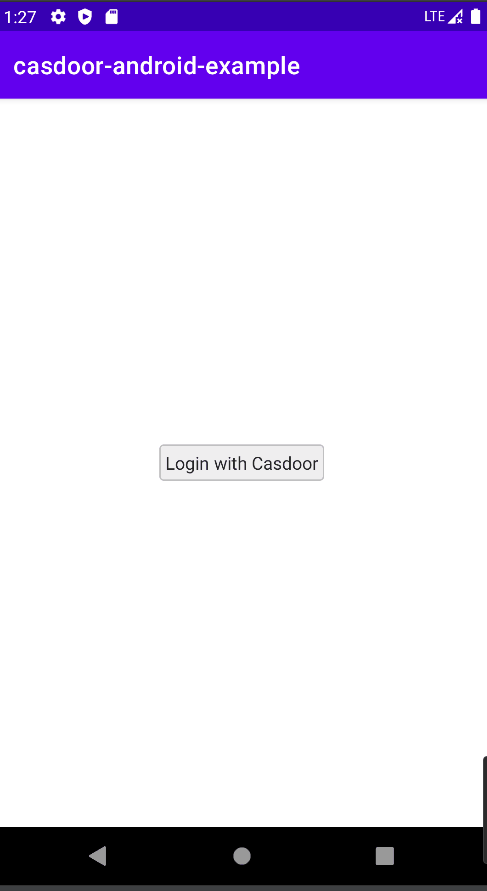

# Casdoor Android Example

[](https://github.com/casdoor/casdoor-android-example/actions/workflows/build.yml)
[](https://github.com/casdoor/casdoor-android-example/blob/master/LICENSE)
[](https://discord.gg/5rPsrAzK7S)

An example Android app in Kotlin that signs users in with [Casdoor](https://casdoor.ai/) using [casdoor-android-sdk](https://github.com/casdoor/casdoor-android-sdk).



## How it works

1. **Login with Casdoor** calls `casdoor.getSignInUrl()` with a random state. The SDK creates a PKCE code verifier and returns the URL of the Casdoor sign-in page ([MainActivity.kt](app/src/main/java/com/example/casdoor_android_example/MainActivity.kt)).
2. [WebViewActivity](app/src/main/java/com/example/casdoor_android_example/WebViewActivity.kt) shows the page in a WebView. After signing in, Casdoor redirects to `casdoor://callback?code=...&state=...`; the activity catches that redirect, checks the state and returns the code.
3. `casdoor.requestOauthAccessToken(code)` exchanges the code for the tokens with the code verifier, so no client secret is stored in the app.
4. `casdoor.getUserInfo(accessToken)` reads the user, and the app shows the username. **Logout** ends the Casdoor session (`casdoor.logout()`).

The SDK makes blocking network calls, so the app calls it from a coroutine on `Dispatchers.IO`.

## Prerequisites

- [Android Studio](https://developer.android.com/studio), or JDK 17+ with the Android SDK (API 36)
- A device or an emulator with Android 6.0 (API 23) or later
- A Casdoor server. The example is preconfigured for the public demo server https://door.casdoor.com, so it runs as is. To use your own, see [Casdoor installation](https://casdoor.ai/docs/basic/server-installation).

## Configuration

Skip this section to try the example with the public demo server.

In your Casdoor, create (or reuse) an organization and an application, and add `casdoor://callback` to the application's **Redirect URLs**. Then fill in `CasdoorConfig` in [MainActivity.kt](app/src/main/java/com/example/casdoor_android_example/MainActivity.kt):

```kotlin
private val casdoor = Casdoor(
    CasdoorConfig(
        endpoint = "https://door.casdoor.com", // Casdoor server URL
        clientID = "014ae4bd048734ca2dea", // client ID of the application
        organizationName = "casbin", // organization of the application
        redirectUri = "casdoor://callback",
        appName = "app-casnode" // name of the application
    )
)
```

## Run

```shell
git clone https://github.com/casdoor/casdoor-android-example
```

Open the folder in Android Studio and press **Run**, or from the command line with a device connected:

```shell
cd casdoor-android-example
./gradlew installDebug
```

Tap **Login with Casdoor**. On the demo server, sign in with username `admin` and password `123`.

## Resources

- [Casdoor documentation](https://casdoor.ai/docs/overview)
- [casdoor-android-sdk](https://github.com/casdoor/casdoor-android-sdk)

## License

[Apache-2.0](LICENSE)
